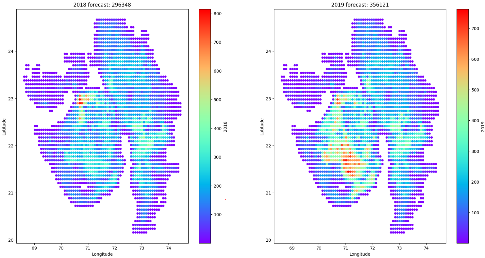
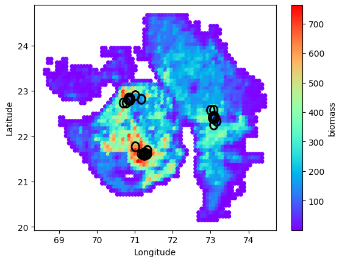

# shell-ai-hackathon-2023

Biomass forecasting and supply chain optimization for the Shell.ai hackathon 2023


## Getting started

Install dependencies ( using python 3.10)

```
pip install -r requirements.txt
```

notebook kernel needs to be set to the right environment

## Forecasting Methodology

```
notebooks/generate_forecast.ipynb 
```


### Biomass dataset clean up

Fill in some duplicated values that happenened before the 2014 census

### Cluster indexes  

Clusters are priomarily based on the district name, then correlations are checked for each index within each district. Each index is assigned to the district with the highest pearson correlation.

### Create table for crop production  

A table containing multiple crop production for each district is created based on [desagri data](https://data.desagri.gov.in/website/crops-report-major-contributing-district-web).

Some missing values before 2014 have to be filled in due to district merging/ splitting. This is done based on the production conservation before and after the census, using simple ratios for group of districts.

### Add Elevation map and crop land map

Crop land data from [eartstat](http://www.earthstat.org/) and elevation from Nasa Earth observation [NEO](https://neo.gsfc.nasa.gov/dataset_index.php#energy)

### Train model

The pipeline consists of a MaxAbsScaler and an ExtraTreeRegressor, cross validation is performed for each year based on all other years.


| year | test_mae |
|------|----------|
| 2010 | 22.6 |
|2011|19.4|
|2012 |27.7|
|2013 | 32.9|
|2014 |24.9|
|2015 | 20.8|
|2016 |29.1|
|2017 | 29. 6|
| average | 25.9 |


### Inference on 2018 and 2019

The model is trained on all historical data and used for inference on 2018 and 2019, the forecast is stored for further use in the optimization step



## Optimization methodology

```
/notebooks/generate_optimized_locations.ipynb 
```

### Refineries location

Refineries number is defined in order to be able to collect 80% of the biomass production ( problem constraint).

Initial refineries positions are on the center of the main biomass clusters

### Initial depot location by substraction

Do until max iteration is reached :
    
    Starting with around 60 depots spread on regions with high biomass ( >200 ) in a random manner

    1.Calculate the flux to refineries using linear optimization 

    2.Remove depot that is the most under-utilized

    3.Stop if constraints cannot be satisfied when calculating flux from depots to refineries

Extract depot positions giving the best cost over all runs

### Fine tune depot / refineries position using a greedy algorithm

    For each depot + refinery index:

        calculate cost in multiple directions for an initial distance
        keep new position if the cost is lower

    if the cost is not improved after a full loop, the distance is increased

### Final depot and refineries locations ( optimized on 2019)




## Score on 2018 and 2019 for the final submission

| year| forecast mae | optimization cost | score |
|-----|--------------|-------------------|-------|
|2018|24.39|44150|83.49|
|2019|30.69|26786|83.7|